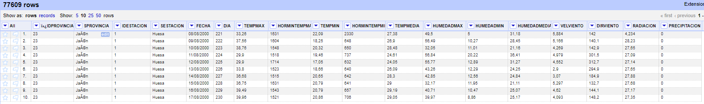
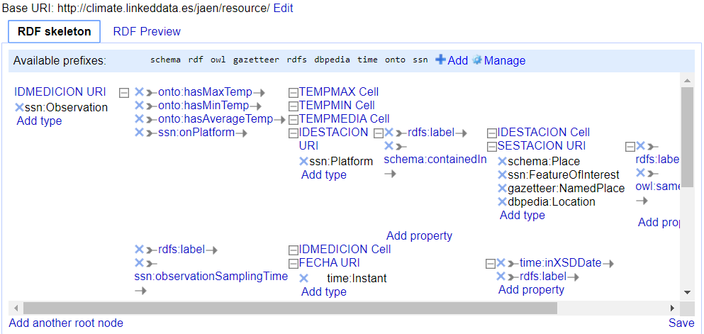
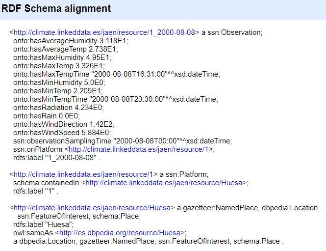
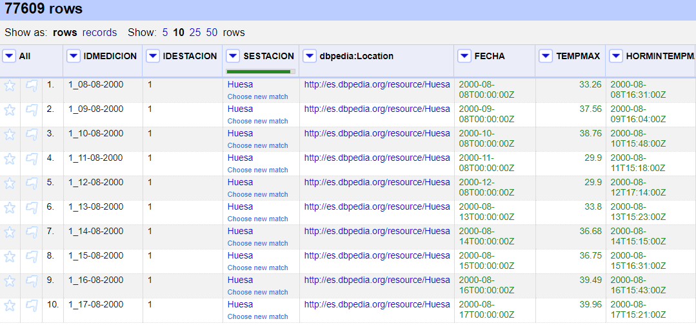

# Memoria del trabajo

#### Índice

1. Introducción

2. Proceso de transformación

   2.1 Selección de la fuente de datos

   2.2 Análisis de los datos

   2.3 Estrategia de nombrado

   2.4 Desarrollo del vocabulario

   2.5 Proceso de transformación

   2.6 Enlazado

3. Aplicación y explotación

4. Conclusiones

5. Bibliografía

#### 1. Introducción

La Web Semántica es un conjunto de tecnologías basadas en la idea de añadir metadatos semánticos y ontológicos a la *World Wide Web*. Esta información adicional, que describe el contenido, significado y relaciones entre los datos, debe expresarse de manera formal, para que pueda ser evaluada de manera automática por máquinas de procesamiento. El precursor de esta idea no es otro que Tim Berners-Lee, creador de organismos y tecnologías fundamentales en el mundo de la informática, como la WWW, el W3C, HTML y HTTP, entre otros.

Así, en el contexto de la Web Semántica, se habla de datos enlazados, datos estructurados que pueden ser interconectados para recabar y compartir información entre diferentes organismos y personas. La interoperabilidad de estos datos y su integración en diferentes sistemas y vocabularios permite construir aplicaciones complejas y mejoradas.

Actualmente, existen numeros iniciativas promovidas por organismos públicos para abrir sus datos, con objetivo de incrementar la transparencia de los mismos, así como facilitar el desarrollo económico. A pesar de los esfuerzos destinados a esta tarea, nos encontramos con numerosos problemas, entre los que destacan la falta de calidad y disponibilidad de los datos.

Para este trabajo, se ha seleccionado un conjunto de datos de las estaciones de la Red de Información Agroclimática de Andalucía en la provincia de Jaén. Así, en las próximas secciones del trabajo, se procederá a informar sobre las características y organización de estos datos, el análisis realizado sobre los mismos, el desarrollo del vocabulario, el proceso de transformación a RDF, su enlazado con otros vocabularios disponibles y la implementación de varias consultas en SPARQL para la explotación de los datos.

#### 2. Proceso de transformación

##### 2.1 Selección de la fuente de datos

El conjunto de datos escogido hace referencia a mediciones del ámbito agroclimático en distintas ciudades de la provincia de Jaén, obtenidos desde el año 2000 hasta febrero del año 2014. Estos datos fueron publicados por el Instituto de Investigación y Formación Agraria y Pesquera (IFAPA), organismo dependiente de la Consejería de Agricultura, Ganadería, Pesca y Desarrollo Sostenible de la Junta de Andalucía.

Los datos están ubicados en el Portal de la Junta de Andalucía, accesibles desde: https://www.juntadeandalucia.es/datosabiertos/portal/dataset/datos-de-las-estaciones-de-la-red-de-informacion-agroclimatica-de-andalucia-en-la-provincia-de-jaen.

##### 2.2 Análisis de los datos

Estos datos están sujetos a una licencia de uso que especifica el grado de reutilización y apertura de los mismos cuando tratan de ser empleados por otro usuario. Concretamente, la licencia empleada es [CC BY-NC 4.0](https://creativecommons.org/licenses/by-nc/4.0/deed.es_ES) (Reconocimiento-NoComercial 4.0 Internacional), en la que el usuario es libre de compartir y adaptar los datos bajo las condiciones de reconocimiento de autoría y siempre y cuando la finalidad no sea comercial.

Respecto al formato de los datos, estos vienen dados en extensión CSV, con un total de 77609 registros.

A continuación, se explican los diferentes campos que aparecen:

| CAMPO         | TIPO   | DESCRIPCIÓN                                                  |
| ------------- | ------ | ------------------------------------------------------------ |
| IDPROVINCIA   | string | Contiene un único valor para todos los registros: *23*       |
| SPROVINCIA    | string | Contiene un único valor para todos los registros: *Jaén*     |
| IDESTACION    | string | Identificador de la subestación donde se ha realizado la medición |
| SESTACION     | string | Nombre de la ciudad en la que está ubicada la estación       |
| FECHA         | string | Día en el que se realizó cierta medición. Existen datos desde el '09/01/2000' hasta el '01/12/2014' (en ese formato). En ciertos años se realiza una medición al mes, mientras que en otros aparecen datos de varios días consecutivos. |
| DIA           | number | Se corresponde con el día en el que se realizó la medición en referencia al año (e.g., 2 de Febrero equivale al día 33 del año). |
| TEMPMAX       | number | Temperatura máxima registrada en la medición.                |
| HORMINTEMPMAX | string | Hora en la que se ha registrado la temperatura máxima.       |
| TEMPMIN       | number | Temperatura mínima registrada en la medición.                |
| HORMINTEMPMIN | string | Hora en la que se ha registrado la temperatura mínima.       |
| TEMPMEDIA     | number | Temperatura media del día en el que se ha realizado la medición. |
| HUMEDADMAX    | number | Valor de humedad máxima registrada.                          |
| HUMEDADMIN    | number | Valor de humedad mínima registrada.                          |
| HUMEDADMEDIA  | number | Valor de humedad media del día en el que se ha realizado la medición. |
| VELVIENTO     | number | Velocidad del viento registrada.                             |
| DIRVIENTO     | number | Dirección del viento.                                        |
| RADIACION     | number | Valor de radiación registrado.                               |
| PRECIPITACION | number | Valores de precipitaciones registrados.`                     |

##### 2.3 Estrategia de nombrado

No he encontrado ningún vocabulario que exprese datos climáticos de tipo y estructura similares a los de este dataset, por lo que se va a crear uno nuevo que pueda ser expandido en un futuro con datos de otras provincias y territorios.

Al existir un número elevado de registros que además puede crecer en un futuro, se ha optado por utilizar la barra inclinada (/) para definir las URIs de los individuos. En el caso de la URI de la ontología, se utiliza la almohadilla (#), ya que el número de clases es muy pequeño.

Así pues, el patrón de URIs es el siguiente:

- URI de la ontología: http://climate.linkeddata.es/jaen/clima#
- URI de los individuos: http://climate.linkeddata.es/jaen/resource/

Como se puede ver, el nombre de la provincia sobre la que se han medido los datos se incluye en la URI (Jaén). Se puede ver cómo este formato se puede adaptar al resto de provincias de España.

Así, un ejemplo de nombrado para una clase de la ontología sería: http://climate.linkeddata.es/jaen/clima#Measurement. 

De manera análoga, una propiedad vendría expresada como: http://climate.linkeddata.es/jaen/clima#inCity.

Por último, para nombrar un recurso o instancia: http://climate.linkeddata.es/jaen/resource/1_01-02-2002.

##### 2.4 Desarrollo del vocabulario

Un esqueleto básico de la ontología ha sido diseñado utilizando el software *Protégé* en su versión 5.5.0. La visualización se ha llevado a cabo a partir de [OWLGrEd](http://owlgred.lumii.lv/online_visualization/).

Como se puede ver en la imagen, se dispone de tres clases: *Measurement*, *Station* y *Location*. Cada *Measurement* viene definido por la estación y la fecha en la que fue realizado. Así, se dispone de dos *object properties*:

| Nombre     | Dominio     | Rango    |
| ---------- | ----------- | -------- |
| inStation  | Measurement | Station  |
| inLocation | Station     | Location |

Las *data properties* son las siguientes:

| Nombre             | Dominio     | Rango        |
| ------------------ | ----------- | ------------ |
| hasDate            | Measurement | xsd:dateTime |
| hasMaxTemp         | Measurement | xsd:double   |
| hasMaxTempTime     | Measurement | xsd:dateTime |
| hasMinTemp         | Measurement | xsd:double   |
| hasMinTempTime     | Measurement | xsd:dateTime |
| hasAverageTemp     | Measurement | xsd:double   |
| hasMaxHumidity     | Measurement | xsd:double   |
| hasMinHumidity     | Measurement | xsd:double   |
| hasAverageHumidity | Measurement | xsd:double   |
| hasWindSpeed       | Measurement | xsd:double   |
| hasWindDirection   | Measurement | xsd:double   |
| hasRadiation       | Measurement | xsd:double   |
| hasRain            | Measurement | xsd:double   |

##### 2.5 Proceso de transformación

###### 2.5.1 Transformaciones iniciales

A continuación, se detallan las transformaciones realizadas sobre el conjunto de datos original utilizando OpenRefine:

- Se eliminan los campos *IDPROVINCIA*, *SPROVINCIA* y *DIA*, puesto que se ha valorado que la información que aportan es redundante y carece de interés para nuestros datos.
- Corrección de caracteres que aparecían erróneamente formateados en el campo *SESTACION*.
- Transformación a formato *dateTime* para el campo *FECHA*.
- Transformación a formato *number* para los campos *TEMPMAX*, *TEMPMIN*, *TEMPMEDIA*, *HUMEDADMAX*, *HUMEDADMIN*, *HUMEDADMEDIA*, *VELVIENTO*, *DIRVIENTO*, *RADIACION* y *PRECIPITACION*. Para aquellos campos con valores decimales, fue necesario cambiar el formato de '22,36' a '22.36' para que funcionara la transformación.

`replace(value,",",".")`

- En los campos *HORMINTEMPMAX* y *HORMINTEMPMIN*, se ha realizado una transformación de los valores originales para que todos ellos fuesen compatibles con un formato 'HH:mm'. Por ejemplo, aparecían valores como '9', el cual debe interpretarse como '00:09', así como '317', que pasaría a ser '03:17'.

`if (length(value) == 4, value.substring(0,2) + ':' + value.substring(2,4),
if (length(value) == 3, '0' + value.substring(0,1) + ':' + value.substring(1,3),
if (length(value) == 2, '00:' + value,
if (length(value) == 1, '00:0' + value, null))))`

A continuación, se ha concatenado esta información con la fecha de la medición correspondiente para transformar el dato en un instante temporal:

`toString(cells["FECHA"].value.datePart("days")) + '-' + toString(cells["FECHA"].value.datePart("months")) + '-' + toString(cells["FECHA"].value.datePart("year")) + ' ' + value`

Esto ha sido necesario porque que no he encontrado una manera de representar un instante temporal en formato de horas y minutos sin tener que incluir también la fecha, y he pensado que era más útil disponer de los datos en este formato en lugar de una cadena de texto que se limite a representar la hora.

- Al carecer de un campo que tuviese valores distintos para cada fila, se ha tenido que crear un identificador propio. Concretamente, se han concatenado todas las combinaciones de valores de los campos *IDESTACION* y *FECHA*, de manera que, para la estación 2 y fecha '2002/01/10', el valor del identificador sería '2_2002-01-10'. Se ha optado por cambiar la barra inclinada por un guion para evitar confusión en la estrategia de nombrado. La razón por la que se ha escogido *IDESTACION* en lugar de *SESTACION* es porque existe una *SESTACION* con más de una *IDESTACION*, mientras que esto no ocurre en sentido contrario: cada *IDESTACION* está asociado a una sola *SESTACION*. Dicho de otro modo, una ciudad puede tener más de una estación, pero una estación pertenece a una sola ciudad. Se ha decidido el nombre de *IDMEDICION* para este campo.

`cells["IDESTACION"].value + "_" + replace(cells["FECHA"].value,"/","-")`

###### 2.5.2 Transformaciones a RDF

Una vez realizadas estas transformaciones, se procede a generar el esqueleto RDF a partir de la extensión de RDF para OpenRefine.

En primer lugar, se fija la URI base a la que se había decidido en la estrategia de nombrado. Además, se añaden los siguientes prefijos:

| Prefijo   | URI                                                     |
| --------- | ------------------------------------------------------- |
| onto      | http://climate.linkeddata.es/jaen/onto#                 |
| ssn       | http://purl.oclc.org/NET/ssnx/ssn#                      |
| dbpedia   | http://dbpedia.org/resource/                            |
| gazetteer | http://data.ordnancesurvey.co.uk/ontology/50kGazetteer/ |
| schema    | http://schema.org/                                      |
| rdfs      | http://www.w3.org/2000/01/rdf-schema#                   |
| owl       | http://www.w3.org/2002/07/owl#                          |

El nodo raíz se corresponde con el campo *IDMEDICION*, que se corresponde con nuestro identificador único. Su tipo se fija a *ssn:Observation*.

A esta *Observation* se le añaden dos *object properties*: *ssn:onPlatform* y *ssn:observationSamplingTime*. La primera se relaciona con el campo *IDESTACION*, de tipo *ssn:Platform*, y que tiene dos propiedades: *rdfs:label*, que se corresponde con el valor del campo tomado como un literal,  y *schema:containedIn*, que hace referencia al campo *SESTACION* (eliminando los espacios para la URI), el cual se define con los siguientes tipos:

- schema:Place
- ssn:FeatureOfInterest
- gazetteer:NamedPlace
- dbpedia:Location

Originalmente, se había pensado identificar los valores de este campo como individuos de la clase *dbpedia:PopulatedPlace*, pero una de las estaciones no está situada en un pueblo o ciudad, sino en un lago. Por lo tanto, se ha decidido utilizar *dbpedia:Location* en su lugar.

Desde *SESTACION* se crea una única *data property*: *rdfs:label*, con el valor correspondiente a ese campo, tomado como un literal.

Volviendo a las *object properties* del nodo raíz, faltan por detallar la propiedad *ssn:observationSamplingTime*, que se relaciona con el campo *FECHA*, de tipo *xsd:dateTime*;  y  *onto:hasMaxTempTime* y *onto:hasMinTempTime*. Estas propiedades apuntan a una URI de los campos correspondientes *HORMINTEMPMAX* y *HORMINTEMPMIN*,  también del tipo *xsd:dateTime*, incluyendo así el tiempo (en horas y minutos) en el que se registraron esos valores de temperatura.

El resto de *data properties* vienen definidas con el prefijo *onto* y se relacionan con cada uno de los campos restantes referentes a temperatura, humedad, viento, radiación y precipitaciones. Los valores de cada uno de los campos se definen con el tipo *xsd:double*.

En esta imagen se puede ver también el enlazado que se ha hecho con la ontología DBpedia, que será detallada en la próxima sección. Los datos, aunque aparecen en formato *Turtle* en la imagen, se han exportado a formato RDF/XML, puesto que el otro formato resultaba en un *server failure*.

##### 2.6 Enlazado

Para el enlazado con otras ontologías, únicamente se ha identificado como adecuado el campo *SESTACION*. Este campo contiene nombres de distintas ciudades de la provincia de Jaén. Como ontología a enlazar, se ha seleccionado DBpedia, concretamente la clase *Location*.

Originalmente, se pretendía reconciliar los valores de *SESTACION* con valores del tipo *PopulatedPlace*, pero se descartó esta idea al existir un valor en la columna que representa un lago, y que por lo tanto no resulta adecuado para su representación con esta clase. A pesar de ello, con la clase *Location* tampoco he sido capaz de reconciliar ese valor. Aún así, la clase *Location* parece más adecuada cuando tenemos en cuenta la naturaleza de los datos.

Los pasos a seguir han sido:

1. Añadir un servicio de reconciliación basado en un *SPARQL endpoint*, con URL http://es.dbpedia.org/sparql.
2. Reconciliar la columna *SESTACION* con la clase *dbo:Location* (http://dbpedia.org/ontology/Location)
3. Crear una nueva columna llamada *dbpedia:Location* basada en la columna *SESTACION* mediante el siguiente comando en GREL: `cell.recon.match.id`.
4. Editar el esqueleto RDF para añadir la propiedad *owl:sameAs* con entre las URIs de ambas columnas.

#### 3. Aplicación y explotación

Para la explotación de los datos, se va a emplear la API de *Jena* sobre *Eclipse* para construir consultas *SPARQL*. Las consultas implementadas son las siguientes:

- **Consulta 1:** extraer los nombres de todas las localizaciones y sus URIs reconciliadas de DBpedia.

`queryString =
				"PREFIX ssn: <" + ssn + "> " +
				"PREFIX schema: <" + schema + "> " +
				"PREFIX rdfs: <" + rdfs  + "> " +
				"PREFIX owl: <" + owl + "> " +
				"SELECT DISTINCT ?DBLocation ?Name " +
				"WHERE { ?Measurement ssn:onPlatform ?Platform. " +
				"?Platform schema:containedIn ?Location. " +
				"?Location rdfs:label ?Name. " +
				"?Location owl:sameAs ?DBLocation. }";`

Salida:

Name: Pozo Alcón                    	        DBpedia: [http://es.dbpedia.org/resource/Pozo_Alcón](http://es.dbpedia.org/resource/Pozo_Alcón)
Name: Jódar                         	             DBpedia: [http://es.dbpedia.org/resource/Jódar](http://es.dbpedia.org/resource/Jódar)
Name: Mancha Real                             DBpedia: http://es.dbpedia.org/resource/Mancha_Real
Name: Sabiote                                       DBpedia: http://es.dbpedia.org/resource/Sabiote
Name: Alcaudete                                   DBpedia: http://es.dbpedia.org/resource/Alcaudete
Name: Torreblascopedro                     DBpedia: http://es.dbpedia.org/resource/Torreblascopedro
Name: Huesa                                         DBpedia: http://es.dbpedia.org/resource/Huesa
Name: Chiclana de Segura                  DBpedia: http://es.dbpedia.org/resource/Chiclana_de_Segura
Name: Úbeda                                        DBpedia: [http://es.dbpedia.org/resource/Úbeda](http://es.dbpedia.org/resource/Úbeda)
Name: Torreperogil                              DBpedia: http://es.dbpedia.org/resource/Torreperogil
Name: Jaén                                             DBpedia: [http://es.dbpedia.org/resource/Jaén](http://es.dbpedia.org/resource/Jaén)
Name: Marmolejo                                 DBpedia: http://es.dbpedia.org/resource/Marmolejo
Name: Santo Tomé                               DBpedia: [http://es.dbpedia.org/resource/Santo_Tomé_(Jaén)](http://es.dbpedia.org/resource/Santo_Tomé_(Jaén))
Name: Villacarrillo                                 DBpedia: http://es.dbpedia.org/resource/Villacarrillo
Name: Linares                                        DBpedia: [http://es.dbpedia.org/resource/Linares_(Jaén)](http://es.dbpedia.org/resource/Linares_(Jaén))
Name: La Higuera de Arjona          	 DBpedia: [http://es.dbpedia.org/resource/Lahiguera_(Jaén)](http://es.dbpedia.org/resource/Lahiguera_(Jaén))
Name: IFAPA Centro Mengíbar            DBpedia: [http://es.dbpedia.org/resource/Mengíbar_(Jaén)](http://es.dbpedia.org/resource/Mengíbar_(Jaén))
Name: Mengíbar                                    DBpedia: [http://es.dbpedia.org/resource/Mengíbar_(Jaén)](http://es.dbpedia.org/resource/Mengíbar_(Jaén))

- **Consulta 2:** extraer las URIs de todas las mediciones de los meses de Julio y Agosto de 2005 para la estación 2.

`		queryString =
				"PREFIX onto: <" + onto + "> " +
				"PREFIX xsd: <" + xsd + "> " +
				"PREFIX rdfs: <" + rdfs + "> " +
				"PREFIX ssn: <" + ssn + "> " +
				"SELECT ?Measurement " +
				"WHERE { ?Measurement ssn:observationSamplingTime ?Date. " +
				"?Measurement ssn:onPlatform ?Platform. " +
				"?Platform rdfs:label ?Label. " +
			    "FILTER (year(?Date) = 2005 && month(?Date) > 6 && month(?Date) < 9 " +
				"&& ?Label = \'2\') }" +
			    "ORDER BY ?Measurement";`

Salida:

http://climate.linkeddata.es/jaen/resource/2_2005-07-01
http://climate.linkeddata.es/jaen/resource/2_2005-07-02
http://climate.linkeddata.es/jaen/resource/2_2005-07-03
http://climate.linkeddata.es/jaen/resource/2_2005-07-04
http://climate.linkeddata.es/jaen/resource/2_2005-07-05
http://climate.linkeddata.es/jaen/resource/2_2005-07-06
http://climate.linkeddata.es/jaen/resource/2_2005-07-07
http://climate.linkeddata.es/jaen/resource/2_2005-07-08
http://climate.linkeddata.es/jaen/resource/2_2005-07-09
http://climate.linkeddata.es/jaen/resource/2_2005-07-10
http://climate.linkeddata.es/jaen/resource/2_2005-07-11
http://climate.linkeddata.es/jaen/resource/2_2005-07-12
http://climate.linkeddata.es/jaen/resource/2_2005-07-14
http://climate.linkeddata.es/jaen/resource/2_2005-07-15
http://climate.linkeddata.es/jaen/resource/2_2005-07-16
http://climate.linkeddata.es/jaen/resource/2_2005-07-17
http://climate.linkeddata.es/jaen/resource/2_2005-07-18
http://climate.linkeddata.es/jaen/resource/2_2005-07-19
http://climate.linkeddata.es/jaen/resource/2_2005-07-20
http://climate.linkeddata.es/jaen/resource/2_2005-07-21
http://climate.linkeddata.es/jaen/resource/2_2005-07-22
http://climate.linkeddata.es/jaen/resource/2_2005-07-23
http://climate.linkeddata.es/jaen/resource/2_2005-07-24
http://climate.linkeddata.es/jaen/resource/2_2005-07-25
http://climate.linkeddata.es/jaen/resource/2_2005-07-26
http://climate.linkeddata.es/jaen/resource/2_2005-07-27
http://climate.linkeddata.es/jaen/resource/2_2005-07-28
http://climate.linkeddata.es/jaen/resource/2_2005-07-29
http://climate.linkeddata.es/jaen/resource/2_2005-07-30
http://climate.linkeddata.es/jaen/resource/2_2005-07-31
http://climate.linkeddata.es/jaen/resource/2_2005-08-01
http://climate.linkeddata.es/jaen/resource/2_2005-08-02
http://climate.linkeddata.es/jaen/resource/2_2005-08-03
http://climate.linkeddata.es/jaen/resource/2_2005-08-04
http://climate.linkeddata.es/jaen/resource/2_2005-08-05
http://climate.linkeddata.es/jaen/resource/2_2005-08-06
http://climate.linkeddata.es/jaen/resource/2_2005-08-07
http://climate.linkeddata.es/jaen/resource/2_2005-08-08
http://climate.linkeddata.es/jaen/resource/2_2005-08-09
http://climate.linkeddata.es/jaen/resource/2_2005-08-10
http://climate.linkeddata.es/jaen/resource/2_2005-08-11
http://climate.linkeddata.es/jaen/resource/2_2005-08-12
http://climate.linkeddata.es/jaen/resource/2_2005-08-13
http://climate.linkeddata.es/jaen/resource/2_2005-08-14
http://climate.linkeddata.es/jaen/resource/2_2005-08-15
http://climate.linkeddata.es/jaen/resource/2_2005-08-16
http://climate.linkeddata.es/jaen/resource/2_2005-08-17
http://climate.linkeddata.es/jaen/resource/2_2005-08-18
http://climate.linkeddata.es/jaen/resource/2_2005-08-19
http://climate.linkeddata.es/jaen/resource/2_2005-08-20
http://climate.linkeddata.es/jaen/resource/2_2005-08-21
http://climate.linkeddata.es/jaen/resource/2_2005-08-22
http://climate.linkeddata.es/jaen/resource/2_2005-08-23
http://climate.linkeddata.es/jaen/resource/2_2005-08-24
http://climate.linkeddata.es/jaen/resource/2_2005-08-25
http://climate.linkeddata.es/jaen/resource/2_2005-08-26
http://climate.linkeddata.es/jaen/resource/2_2005-08-27
http://climate.linkeddata.es/jaen/resource/2_2005-08-28
http://climate.linkeddata.es/jaen/resource/2_2005-08-29
http://climate.linkeddata.es/jaen/resource/2_2005-08-30
http://climate.linkeddata.es/jaen/resource/2_2005-08-31

- **Consulta 3:** extraer todas las mediciones cuya máxima temperatura sobrepase los 40 grados, junto con el propio valor de temperatura.

`		queryString =
				"PREFIX onto: <" + onto + "> " +
				"PREFIX xsd: <" + xsd + "> " +
				"PREFIX rdfs: <" + rdfs + "> " +
				"PREFIX ssn: <" + ssn + "> " +
				"SELECT ?Measurement ?AvgTemp " +
				"WHERE { ?Measurement onto:hasMaxTemp ?MaxTemp. " +
				"?Measurement onto:hasAverageTemp ?AvgTemp. " +
			    "FILTER (?MaxTemp > 40.0) }";`

Salida:

...

http://climate.linkeddata.es/jaen/resource/5_2005-06-22: 31.54
http://climate.linkeddata.es/jaen/resource/8_2010-08-07: 30.83
http://climate.linkeddata.es/jaen/resource/5_2004-06-29: 30.26
http://climate.linkeddata.es/jaen/resource/5_2006-01-08: 30.92
http://climate.linkeddata.es/jaen/resource/10_2004-08-25: 28.78
http://climate.linkeddata.es/jaen/resource/8_2005-03-07: 28.98

...

- **Consulta 4:** extraer el día que llovió más.

`		queryString =
				"PREFIX onto: <" + onto + "> " +
				"PREFIX ssn: <" + ssn + "> " +
				"SELECT ?Date ?Precip " +
				"WHERE { ?Measurement onto:hasRain ?Precip. " +
				"?Measurement ssn:observationSamplingTime ?Date. }" +
			    "ORDER BY DESC(?Precip) " +
				"LIMIT 1";`

Salida:

2007-11-20 - Rain amount: 83.6

- **Consulta 5:** extraer la mínima temperatura registrada, junto con la fecha y hora en la que sucedió y la localización correspondiente a la estación responsable de la medición.

`		queryString =
				"PREFIX onto: <" + onto + "> " +
				"PREFIX rdfs: <" + rdfs + "> " +
				"PREFIX ssn: <" + ssn + "> " +
				"PREFIX schema: <" + schema + "> " +
				"SELECT ?Date ?Temp ?PlaceName " +
				"WHERE { ?Measurement onto:hasMinTemp ?Temp. " +
				"?Measurement onto:hasMinTempTime ?Date. " +
				"?Measurement ssn:onPlatform ?Station. " +
				"?Station schema:containedIn ?Place. " +
				"?Place rdfs:label ?PlaceName. }" +
			    "ORDER BY ?Temp " +
				"LIMIT 1";`		

Salida:

The minimum temperature ever registered is -18.0 on 2010-11-17T09:39:00 at La Higuera de Arjona

- **Consulta 6:** extrae la máxima temperatura registrada en las estaciones localizadas en Huesa junto con su fecha y hora.

`		queryString =
				"PREFIX onto: <" + onto + "> " +
				"PREFIX rdfs: <" + rdfs + "> " +
				"PREFIX ssn: <" + ssn + "> " +
				"PREFIX schema: <" + schema + "> " +
				"SELECT ?Date ?Temp " +
				"WHERE { ?Measurement onto:hasMaxTemp ?Temp. " +
				"?Measurement onto:hasMaxTempTime ?Date. " +
				"?Measurement ssn:onPlatform ?Station. " +
				"?Station schema:containedIn ?Place. " +
				"?Place rdfs:label ?PlaceName. " +
				"FILTER (?PlaceName = \'Huesa\') } " +
			    "ORDER BY DESC(?Temp) " +
				"LIMIT 1";`		

Salida:

Highest temperature registered at Huesa is 55.11 on date 2006-07-10T18:40:00

#### 4. Conclusiones

En este trabajo, se ha seleccionado un conjunto de datos de naturaleza agroclimática medidos en la provincia de Jaén. Estos datos, que estaban en formato CSV, han sido importados en OpenRefine y limpiados. Tras diseñar la ontología correspondiente, se ha realizado la transformación a RDF desde OpenRefine, así como una reconciliación de uno de los campos con el vocabulario de DBpedia. Por último, se ha implementado una aplicación en la API de Jena para realizar consultas SPARQL al conjunto de datos transformado, obteniendo diversos resultados que tratan de demostrar la utilidad de los mismos. 

#### 5. Bibliografía

- Wiki de Protégé: https://protegewiki.stanford.edu/wiki/Main_Page
- Documentación de Google Refine Expression Language (GREL): https://github.com/OpenRefine/OpenRefine/wiki/Documentation-For-Users#reference
- Transparencias de la asignatura "Web Semántica y Datos Enlazados"
- Datos abiertos de la Junta de Andalucía: https://www.juntadeandalucia.es/datosabiertos/portal.html